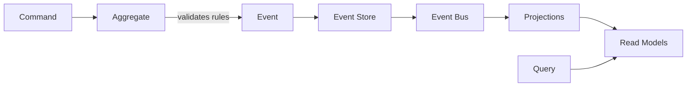

# Event Sourcing

Event Sourcing stores **state changes as events** rather than current state. Instead of saving what the data looks like now, you save the sequence of events that led to that state.

## The Core Idea

Traditional databases store current state and discard history:

```
Traditional Storage:
{ id: 'acc-123', balance: 1000 }
```
You know the current balance, but not how you got there.

Event Sourcing stores the complete history:

```
Event Sourcing:
[
  { type: 'AccountOpened', payload: { initialBalance: 0 } },
  { type: 'MoneyDeposited', payload: { amount: 500 } },
  { type: 'MoneyDeposited', payload: { amount: 500 } }
]
```
You have every change that ever happened, in order.

**Key insight**: Events are facts about the past. State is just the result of applying those facts.

## Why Event Sourcing Matters

**Complete Audit Trail**: You know exactly what happened, when it happened, and in what order. Perfect for regulated industries, debugging, and understanding system behavior.

**Temporal Queries**: Answer questions like "What was the balance on January 1st?" by replaying events up to that date. The past is never lost.

**Event Replay**: Reproduce bugs by replaying the exact sequence of events that caused them. Test new business rules against historical data.

**Business Intelligence**: Events capture intent and business decisions, not just final state. Rich source for analytics and reporting.

**System Integration**: Events become the API for other systems. Subscribe to events and build new features without touching existing code.

## Event Immutability

Events are **immutable facts about the past**. Once something happened, you can't unhappen it.

This means:
- Events are append-only (never update or delete)
- Corrections are new events (not edits to old events)
- Complete history is always available
- No lost data from updates overwriting previous state

If you need to fix a mistake, you don't change the past event—you add a new compensating event.

## State Derivation

Current state is **calculated by replaying events**:

1. Start with empty state
2. Apply first event → state changes
3. Apply second event → state changes again
4. Continue until all events applied
5. Result = current state

This means:
- State can be rebuilt at any time from events
- Multiple different states can be derived from same events
- Lose your database? Rebuild it from events
- Need a new read model? Replay events into it

## How EventFlows Uses Event Sourcing

EventFlows treats events as first-class citizens:

**EventStore**: Persists events in append-only streams, ensuring immutability and order

**AggregateRoot**: Emits events when business rules are satisfied, building history naturally

**EventEnvelope**: Wraps events with metadata (timestamp, version, stream info)

**EventBus**: Publishes events to subscribers for building projections and triggering side effects

The library handles the technical mechanics of event storage and replay while you focus on modeling meaningful business events.

## Event Sourcing + CQRS

Event Sourcing and CQRS work naturally together:

**Write Side**: Aggregates emit events that are stored in the event store

**Read Side**: Event handlers subscribe to events and update optimized read models

**The Flow**:



1. Command → Aggregate validates business rules
2. Aggregate emits event
3. Event stored in event store
4. Event published to event bus
5. Projection handlers update read models
6. Queries fetch from read models

This separation means writes can focus on business logic while reads can be optimized for specific query patterns.

## Event Versioning

Business requirements change. Events need to evolve:

**Strategy 1 - Upcasting**: Convert old events to new format when reading

**Strategy 2 - Multiple Versions**: Handle multiple event versions in your code

**Strategy 3 - Weak Schema**: Use flexible event structures that tolerate change

EventFlows supports all strategies—choose based on your needs.

## When to Use Event Sourcing

**Event Sourcing is valuable when:**
- You need complete audit trails for compliance or debugging
- Temporal queries matter (state at a point in time)
- Business events are important domain concepts
- You want to derive multiple read models from same events
- Event-driven integration with other systems is needed

**Event Sourcing might be overkill when:**
- You only care about current state, not history
- Simple CRUD with no complex business logic
- Event replay would be too expensive
- Your team isn't ready for eventual consistency

## Event Sourcing in Practice with EventFlows

When you build with Event Sourcing and EventFlows:

1. **Model meaningful events** that capture business intent (not just data changes)
2. **Design aggregates** that emit events when business rules are satisfied
3. **Store events** in event streams organized by aggregate type and ID
4. **Build projections** by subscribing to events and updating read models
5. **Embrace immutability** - never modify events, only append new ones

EventFlows provides the event store, event bus, and aggregate primitives while you focus on modeling the right events for your domain.

## Next Steps

Learn how Event Sourcing fits with other patterns:

- [CQRS](./cqrs) - Separating reads and writes around events
- [Domain-Driven Design](./domain-driven-design) - Modeling aggregates that emit events
- [Clean Architecture](./clean-architecture) - Keeping event logic independent of infrastructure

For implementation details, explore:
- [Aggregates](/command-side/aggregates) - Emitting and applying events
- [Event Store](/command-side/event-store) - Persisting events immutably
- [Projections](/query-side/projections) - Building read models from events
